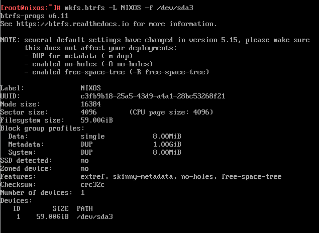

# Здесь будут заметки ко всему

- [Создание загрузочной флешки (Live CD)](#Создание-загрузочной-флешки-Live-CD)

#### Создание загрузочной флешки Live CD  

if - откуда, of - куда. Можно таким образом создавать бэкапы, утилита мощная  
```bash
sudo dd if=/home/whoami/Downloads/nixos-minimal-24.11.717822.0c0bf9c05738-x86_64-linux.iso of=/dev/sda bs=4M status=progress oflag=sync
```

Утилитки если вдруг всё сломалось 
```
lsblk
fdisk -l
cfdisk
``` 

Пересборка grub:   
```bash
grub-install --target=x86_64-efi --efi-directory=/boot/efi --bootloader-id=GRUB
mkinitcpio -P
grub-mkconfig -o /boot/grub/grub.cfg
```

Глянуть id разделов
```bash
blkid /dev/nvme1n1p1
```

Troubleshooting  
```bash
fsck.fat -v /dev/nvme1n1p1  # Проверка FAT32 (EFI)
btrfstune -U random /dev/nvme1n1p2
```

Зайти в смонтированные разделы

предварительно смонтировав  
```bash
mount /dev/nvme1n1p2 /mnt           # Корень
mount /dev/nvme1n1p1 /mnt/boot/efi  # EFI

arch-chroot /mnt
```


При установке форматирование будет примерно такое  
```bash
mkfs.fat -F 32 -n BOOT /dev/sda1
mkswap -L swap /dev/sda2
sudo mkfs.btrfs -L NIXOS -f /dev/sda3
```



subvolumes:  
```
mount -t btrfs /dev/sda3 /mnt
cd /mnt
btrfs subvolume create @
btrfs subvolume create @home
btrfs subvolume create @nix
btrfs subvolume create @snapshots
cd
umount /mnt
```

