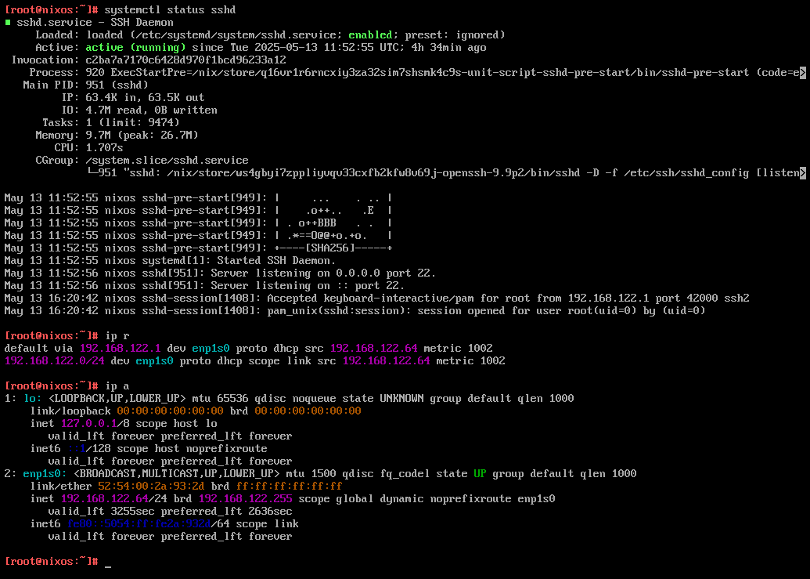
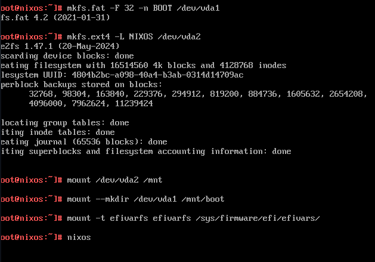
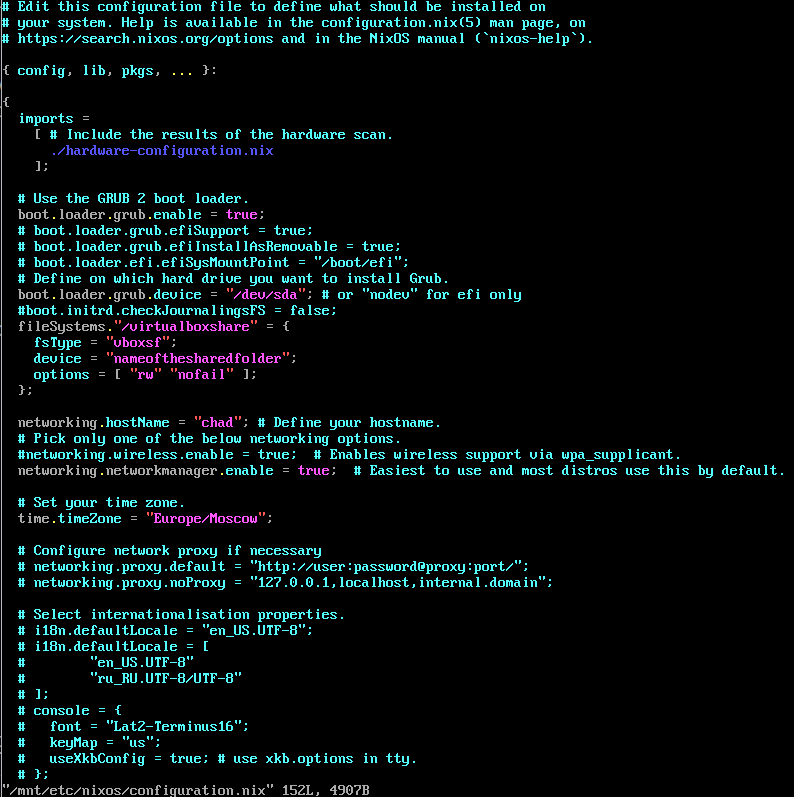
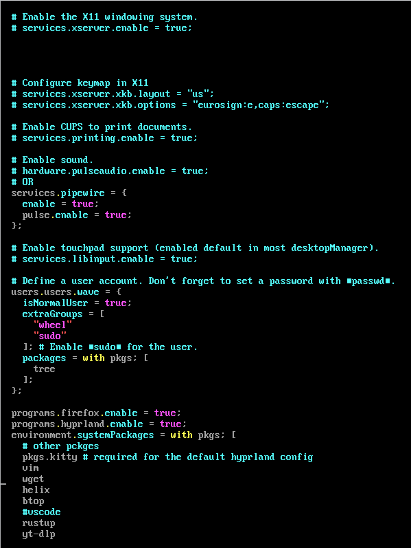
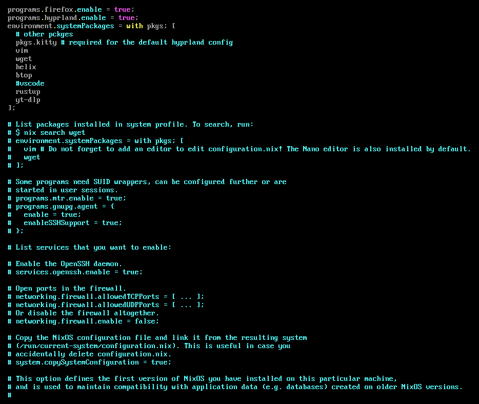
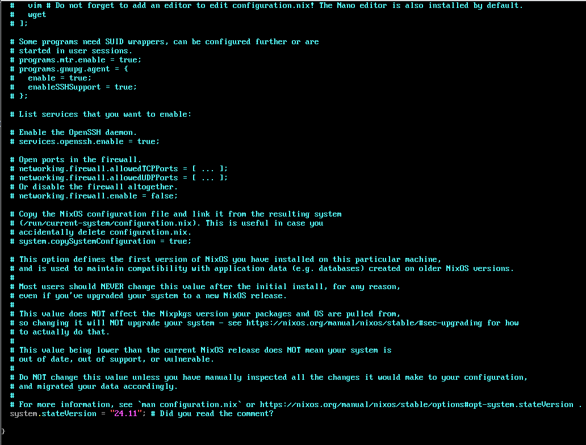

# Здесь будут заметки ко всему

- [Создание загрузочной флешки (Live CD)](#Создание-загрузочной-флешки-Live-CD)
- [Установка-QEMU](#Установка-QEMU)
- [Возимся с NixOS](#Возимся-с-NixOS)
- [Other](#Other)

#### Создание загрузочной флешки Live CD  

if - откуда, of - куда. Можно таким образом создавать бэкапы, утилита мощная  
```bash
sudo dd if=/home/$(whoami)/Downloads/nixos-minimal-24.11.717822.0c0bf9c05738-x86_64-linux.iso of=/dev/sda bs=4M status=progress oflag=sync
```

#### Установка QEMU

```
yay -S fmanager virt-viewer dnsmasq vde2 bridge-utils openbsd-netcat

sudo systemctl start libvirtd.service

sudo systemctl status libvirtd.service
```

После перезагрузки пишет что-то вроде этого:

```cpp
Error starting domain: Requested operation is not valid: network 'default' is not active

Traceback (most recent call last):
  File "/usr/share/virt-manager/virtManager/asyncjob.py", line 71, in cb_wrapper
    callback(asyncjob, *args, **kwargs)
    ~~~~~~~~^^^^^^^^^^^^^^^^^^^^^^^^^^^
  File "/usr/share/virt-manager/virtManager/asyncjob.py", line 107, in tmpcb
    callback(*args, **kwargs)
    ~~~~~~~~^^^^^^^^^^^^^^^^^
  File "/usr/share/virt-manager/virtManager/object/libvirtobject.py", line 57, in newfn
    ret = fn(self, *args, **kwargs)
  File "/usr/share/virt-manager/virtManager/object/domain.py", line 1384, in startup
    self._backend.create()
    ~~~~~~~~~~~~~~~~~~~~^^
  File "/usr/lib/python3.13/site-packages/libvirt.py", line 1390, in create
    raise libvirtError('virDomainCreate() failed')
libvirt.libvirtError: Requested operation is not valid: network 'default' is not active

```

Пробую решение:

```bash
sudo virsh net-define /etc/libvirt/qemu/networks/default.xml
sudo virsh net-start default
sudo virsh net-autostart default
```

И оно сработало


#### Возимся с NixOS

Установка и возня

Если устанавливаем на Vbox, не забываем галку Enable EFI и галку что используем ssd.

После этого момента в этот же день я узнал про qemu...
А там всё удобнее

Отличный гайд на установку

https://devctrl.blog/posts/step-by-step-guide-installing-nix-os-on-virtual-box/

Для удобства нужно подключиться по ssh




На guest:

Проверяем что sshd активен

```
systemctl status sshd
```

Задаём пароль:

```
passwd root
```

Затем вводим команды чтобы узнать ip (либо в qemu view from 'console' to 'details' to 'NIC' )

```
ip r
ip a
```

вывод будет примерно таким:

```

[root@nixos:~]# systemctl status sshd
● sshd.service - SSH Daemon
     Loaded: loaded (/etc/systemd/system/sshd.service; enabled; preset: ignored)
     Active: active (running) since Tue 2025-05-13 11:52:55 UTC; 4h 43min ago
 Invocation: c2ba7a7170c6428d970f1bcd96233a12
    Process: 920 ExecStartPre=/nix/store/q16vr1r6rncxiy3za32sim7shsmk4c9s-unit-script-sshd-pre-start/bin/sshd-pre-start (code=exited, status=0/SUCCESS)
   Main PID: 951 (sshd)
         IP: 184K in, 198K out
         IO: 4.7M read, 0B written
      Tasks: 1 (limit: 9474)
     Memory: 9.5M (peak: 26.7M)
        CPU: 1.707s
     CGroup: /system.slice/sshd.service
             └─951 "sshd: /nix/store/ws4gbyi7zppliyvqv33cxfb2kfw8v69j-openssh-9.9p2/bin/sshd -D -f /etc/ssh/sshd_config [listener] 0 of 10-100 startups"

May 13 11:52:55 nixos sshd-pre-start[949]: |     ...    . .. |
May 13 11:52:55 nixos sshd-pre-start[949]: |    .o++..   .E  |
May 13 11:52:55 nixos sshd-pre-start[949]: | . o++BBB   . .  |
May 13 11:52:55 nixos sshd-pre-start[949]: | .*==O@@+o.+o.   |
May 13 11:52:55 nixos sshd-pre-start[949]: +----[SHA256]-----+
May 13 11:52:55 nixos systemd[1]: Started SSH Daemon.
May 13 11:52:56 nixos sshd[951]: Server listening on 0.0.0.0 port 22.
May 13 11:52:56 nixos sshd[951]: Server listening on :: port 22.
May 13 16:20:42 nixos sshd-session[1408]: Accepted keyboard-interactive/pam for root from 192.168.122.1 port 42000 ssh2
May 13 16:20:42 nixos sshd-session[1408]: pam_unix(sshd:session): session opened for user root(uid=0) by (uid=0)


[root@nixos:~]# ip r
default via 192.168.122.1 dev enp1s0 proto dhcp src 192.168.122.64 metric 1002 
192.168.122.0/24 dev enp1s0 proto dhcp scope link src 192.168.122.64 metric 1002 

[root@nixos:~]# ip a
1: lo: <LOOPBACK,UP,LOWER_UP> mtu 65536 qdisc noqueue state UNKNOWN group default qlen 1000
    link/loopback 00:00:00:00:00:00 brd 00:00:00:00:00:00
    inet 127.0.0.1/8 scope host lo
       valid_lft forever preferred_lft forever
    inet6 ::1/128 scope host noprefixroute 
       valid_lft forever preferred_lft forever
2: enp1s0: <BROADCAST,MULTICAST,UP,LOWER_UP> mtu 1500 qdisc fq_codel state UP group default qlen 1000
    link/ether 52:54:00:2a:93:2d brd ff:ff:ff:ff:ff:ff
    inet 192.168.122.64/24 brd 192.168.122.255 scope global dynamic noprefixroute enp1s0
       valid_lft 3075sec preferred_lft 2456sec
    inet6 fe80::5054:ff:fe2a:932d/64 scope link 
       valid_lft forever preferred_lft forever
```

Замечаем ip адрес

включаем на хосте sshd

```
sudo systemctl start sshd
```

Подключаемся (в моём случае ip адрес гостя был такой: 
  192.168.122.54
) увидел это в default via и в enp1s0 (inet)

```
ssh root@192.168.122.64 -p 22
```


пользуемся cfdisk


При установке форматирование будет примерно такое  
```bash
mkfs.fat -F 32 -n BOOT /dev/sda1
mkswap -L swap /dev/sda2
```

btrfs

```bash
sudo mkfs.btrfs -L NIXOS -f /dev/sda3 # for btrfs
```

для ext4

```bash
mkfs.ext4 -L nixos /dev/sda3
```





subvolumes for btrfs:  
```bash
mount -t btrfs /dev/sda3 /mnt
cd /mnt
btrfs subvolume create @
btrfs subvolume create @home
btrfs subvolume create @nix
btrfs subvolume create @snapshots
cd
umount /mnt
```

Умное монтирование btrfs

```
mount -o compress=zstd,subvol=@ /dev/sda3 /mnt
mkdir -p /mnt/{boot,home,nix,.snapshots}
mount -o compress=zstd,subvol=@home /dev/sda3 /mnt/home
mount -o compress=zstd,subvol=@nix /dev/sda3 /mnt/nix
mount -o compress=zstd,subvol=@snapshots /dev/sda3 /mnt/.snapshots


mount /dev/sda1 /mnt/boot
```

Простое монтирование через ext4

```bash
mount /dev/sda3 /mnt
mount --mkdir /dev/sda1 /mnt/boot
swapon /dev/sda2
mount -t efivarfs efivarfs /sys/firmware/efi/efivars
```

NixOs
```bash
nixos-generate-config --root /mnt

```

Далее очень желательно инициализировать гит репо с конфигом.

```bash
cd /mnt/etc/nixos
git init
git add
  git config --global user.email "<you@example.com>"
  git config --global user.name "<Your Name>"
ssh-keygen
cat /root/.ssh/id_ed25519.pub # примерно так он и будет выглядеть
```
Копируем публичный ключ, вставляем в удалённом репозитории в настройках в блоке ssh.

Создаём репо `nixos` в удалённом GiHub например

```bash
git commit -m "Init NixOS config files"
git remote add origin git@github.com:your_name_on_github/nixos-config.git

git branch -M main
git push -u origin main
```


```bash
nano /mnt/etc/nixos/configuration.nix
nixos-install
```

Ещё недостающие конфиги, но это уже завтра...

```nix
{ config, pkgs, ... }: {
  # Включить Wayland и Hyprland
  programs.hyprland = {
    enable = true;
    xwayland.enable = true;  # Для совместимости с X11-приложениями
  };

  # Графические драйверы (пример для Intel/NVIDIA)
  hardware.opengl.enable = true;
  services.xserver.videoDrivers = [ "nvidia" ];  # Для NVIDIA
  # Или для AMD:
  # hardware.amdgpu.loadInInitrd = true;

  # Пользователь и сессия
  users.users.<ваш_логин> = {
    isNormalUser = true;
    extraGroups = [ "wheel" "video" "render" ];
  };

  # Автовход в TTY (если используете display manager)
  services.displayManager.autoLogin = {
    enable = true;
    user = "<ваш_логин>";
  };

  environment.systemPackages = with pkgs; [
    hyprland
    waybar
    swaylock-effects
    wofi
    kitty  # Терминал
  ];
}
```









вот такая локаль  
```
ru_RU.UTF-8/UTF-8
```
отсюда взято
https://sourceware.org/git/?p=glibc.git;a=blob;f=localedata/SUPPORTED

После установки   
```
nixos-enter --root /mnt -c 'passwd alice'
```

После перезапуска удаляем ключ с хоста:

```
ssh-keygen -R 192.168.122.64
```

затем подключаемся спокойно...

После установки так же слетают ключи `ssh-keygen`

так что нужно заново сгенерить, чтобы и дальше в гит закидывать наш изменяющийся конфиг файл.

Вот некоторые полезные команды

Дистрибутив не такой простой как arch. Там где в arch поиск пакета локально был что то вроде 

```
yay -Qi firefox
```

то в nix всё сложнее

сначала нужно найти пакет...

```
nix-store -q --tree /run/current-system/sw | grep firefox
```

Если что-то отредачили в конфиг файле, нужно перебилдить потом

```bash
sudo nixos-rebuild switch
```

Итого получилось у меня запустить hyprland. Но не запустился kitty. Завтра ещё потыкаю


#### Other

Корректное завершение работы:  
```bash
sudo shutdown -P now
```

Утилитки если вдруг всё сломалось 
```bash
lsblk
fdisk -l
cfdisk
fsck
``` 

iwctl:  
```
iwctl
device list
device <name> set-property Powered on
adapter phy0 set-property Powered on # phy0 - вместо этого подставить то какой у вас адаптер в list
station name scan
station name get-networks
station name scan
station name connect SSID
```

```bash
fsck /dev/nvme0n1p1  # Проверь целостность раздела
```

Пересборка grub:   
```bash
grub-install --target=x86_64-efi --efi-directory=/boot/efi --bootloader-id=GRUB
mkinitcpio -P
grub-mkconfig -o /boot/grub/grub.cfg
```


Пересборка ядра:  
```bash
pacman -S linux linux-zen
mkinitcpio -P
```

Глянуть id разделов
```bash
blkid /dev/nvme1n1p1
```

Troubleshooting  
```bash
fsck.fat -v /dev/nvme1n1p1  # Проверка FAT32 (EFI)
btrfstune -U random /dev/nvme1n1p2
```

Зайти в смонтированные разделы

предварительно смонтировав  
```bash
mount /dev/nvme1n1p2 /mnt           # Корень
mount /dev/nvme1n1p1 /mnt/boot/efi  # EFI

arch-chroot /mnt
```


swap-file (на Arch)

```bash
swapon --show
df -Th /swapfile
sudo rm /swapfile
sudo touch /swapfile
sudo chattr +C /swapfile
sudo fallocate -l 16G /swapfile
sudo chmod 600 /swapfile
sudo mkswap /swapfile
sudo swapon /swapfile
swapon --show
free -h
code src/me/guideall/
```
